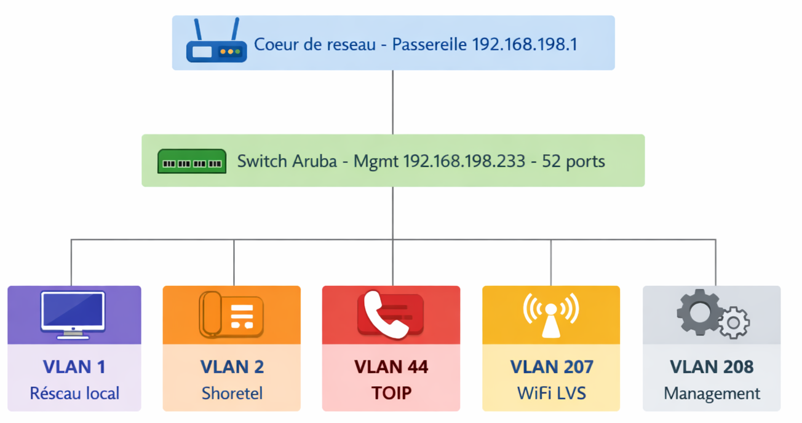
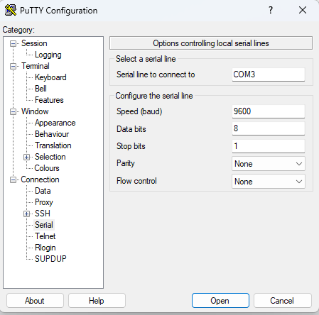
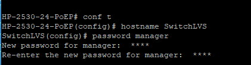
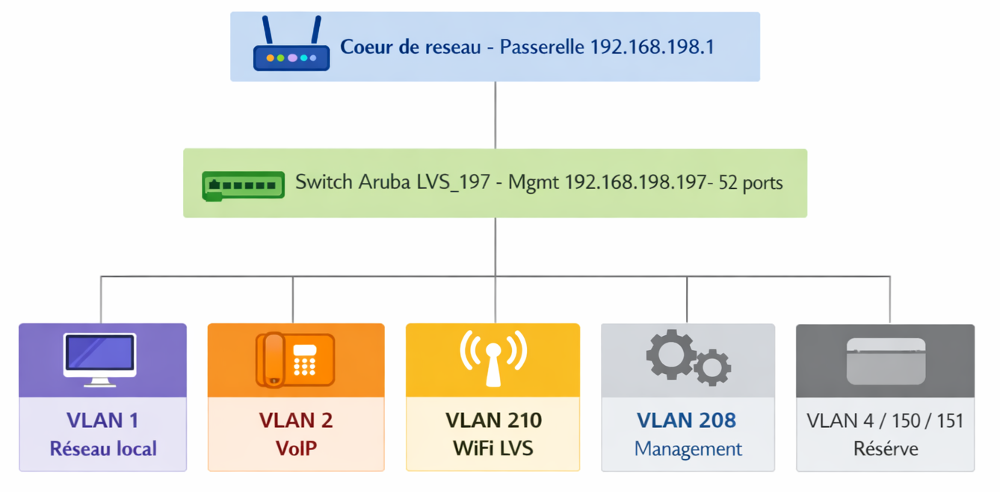
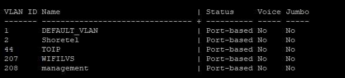
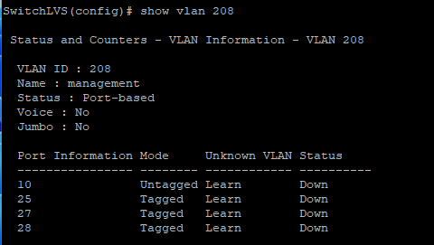
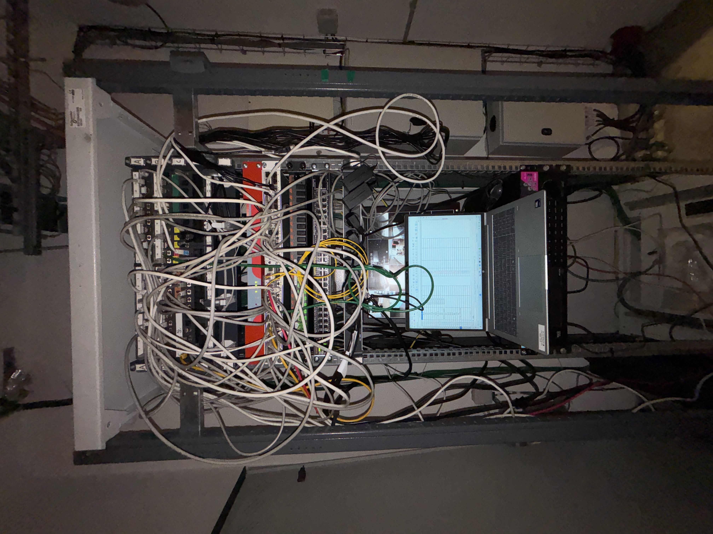

# Remplacement du switch réseau — Centre culturel LVS

## Sommaire

1. [Contexte du projet](#contexte-du-projet)
2. [Objectifs du projet](#objectifs-du-projet)
3. [Ma contribution](#ma-contribution)
4. [Déroulement du projet](#déroulement-du-projet)
   - [1 – Repérage du câblage existant](#1--repérage-du-câblage-existant)
   - [2 – Identification des VLANs existants](#2--identification-des-vlans-existants)
   - [3 – Montée en compétence et configuration du switch Aruba](#3--montée-en-compétence-et-configuration-du-switch-aruba)
   - [4 – Harmonisation du plan de VLANs](#4--harmonisation-du-plan-de-vlans)
   - [5 – Mise en service et reprise du câblage](#5--mise-en-service-et-reprise-du-câblage)
   - [6 – Mise à jour de LibreNMS et de la documentation](#6--mise-à-jour-de-librenms-et-de-la-documentation)
   - [7 – Réaménagement de la banque d'accueil](#7--réaménagement-de-la-banque-daccueil)
5. [Difficultés rencontrées](#difficultés-rencontrées)
6. [Résultats obtenus](#résultats-obtenus)
7. [Compétences mobilisées et acquises](#compétences-mobilisées-et-acquises)
8. [Annexes](#annexes)

---

## Contexte du projet

Dans le cadre de la modernisation de l'infrastructure réseau de la Mairie de Saint-Égrève, l'administrateur système réseau m'a confié le remplacement du switch du **Centre culturel LVS** (cinéma municipal).

L'ancien switch, un **Alcatel-Lucent 52 ports (26×2)**, était en réalité constitué de deux switches accolés, avec un brassage peu lisible et difficile à maintenir. Il devait être remplacé par un **switch Aruba 2530**, déjà présent sur place mais non encore opérationnel.

Cette migration a aussi été l'occasion d'**harmoniser le plan de VLANs** du site avec le reste du parc réseau de la mairie : certains VLANs historiques ont été fusionnés ou renommés, d'autres nouvellement créés pour anticiper les besoins à venir.

Le projet s'inscrit par ailleurs dans le **réaménagement physique de la banque d'accueil** du cinéma, avec une contrainte d'exploitation forte : aucune intervention n'était possible pendant les horaires d'ouverture au public, afin d'éviter tout risque de coupure de service.

**Ancien équipement :** Alcatel-Lucent OS 6.6.3.509.R01 — 52 ports (26×2) — IP de management `192.168.198.233`

**Nouveau matériel :** Switch Aruba 2530, nommé `LVS_197` — IP `192.168.198.197` / masque `255.255.255.0` / passerelle `192.168.198.1`

## Objectifs du projet

Objectifs fixés par l'administrateur système réseau :

- Remplacer le switch principal de la baie informatique
- Remettre à plat et réorganiser le câblage de la baie
- Intervenir dans le cadre du réaménagement de la banque d'accueil LVS (dépose puis réinstallation des postes)
- Garantir la continuité des services réseau du cinéma pendant toute la migration
- Mettre à jour la supervision réseau (LibreNMS) et la documentation technique

**Jalons clés :**

| Date | Étape |
|------|-------|
| 29/04/26 | Repérage du câblage et des VLANs existants |
| 22/07/26 | Décâblage et dépose des équipements de la banque d'accueil (PC, écrans, TPE...) |
| — | Configuration et bascule du nouveau switch |
| 13/08/26 | Réinstallation de la banque d'accueil |
| Début 09/26 | Clôture prévue du projet |

## Ma contribution

J'ai mené ce projet **en autonomie complète**, de bout en bout, sur la base d'un cahier des charges transmis par l'administrateur système réseau :

- **Repérage physique** du câblage existant : identification de chaque prise murale et de son port sur l'ancien switch, avec réattribution d'un nouvel emplacement plus lisible (l'ancien câblage étant peu structuré et mal documenté)
- **Analyse des VLANs existants** via LibreNMS pour cartographier l'usage réel du réseau avant migration
- **Montée en compétence autodidacte** sur la configuration d'un switch Aruba, matériel que je n'avais jusque-là jamais configuré, y compris la connexion en console série (adaptateur USB-Série + PuTTY) puis l'administration à distance en SSH
- **Conception et application du nouveau plan de VLANs harmonisé** avec le reste du parc de la mairie
- **Sécurisation du switch** (mot de passe manager, VLAN de management dédié)
- **Bascule physique et recette réseau** avant mise en production (tests de ping)
- **Mise à jour de LibreNMS et de la documentation technique**
- **Gestion du planning d'intervention** en tenant compte des horaires d'ouverture du cinéma au public

## Déroulement du projet

### 1 – Repérage du câblage existant

Avant toute intervention, j'ai réalisé un repérage complet du câblage existant : chaque câble a été identifié physiquement pour établir la correspondance entre la prise murale et le port du switch. Le câblage d'origine étant peu structuré, j'en ai profité pour réattribuer un nouvel emplacement à chaque équipement, afin d'obtenir un résultat plus lisible et maintenable.

Un tableau de correspondance complet (52 ports) a été créé pour assurer la traçabilité de cette réorganisation.

**Extrait du repérage :**

| Port Switch | Prise murale | VLAN(s) actifs |
| :--- | :--- | :--- |
| **1-1** | B4 | 2, 44 |
| **1-2** | B13 | 1(u), 2, 44 |
| **1-3** | B9 | 2, 44 |
| **1-4** | B1 | 1(u), 2, 44 |

*(tableau complet en annexe)*

### 2 – Identification des VLANs existants

Une analyse de la configuration a été réalisée via **LibreNMS** afin d'identifier les VLANs utilisés, les ports associés (access / trunk) et les équipements connectés.

### Schéma logique du réseau — avant migration

Le schéma ci-dessous synthétise l'architecture logique du réseau telle qu'elle était en production avant la migration.

> [!NOTE]
> Ce schéma représente la structure **logique** du réseau d'origine, pas le brassage physique.

| VLAN | Usage | Description |
|------|--------|-------------|
| **VLAN 1** | Réseau local | Postes utilisateurs et équipements standards |
| **VLAN 2** | Téléphonie IP | Voix (Shoretel) |
| **VLAN 44** | Téléphonie IP | Voix (TOIP) |
| **VLAN 207** | WiFi LVS | Réseau sans-fil du cinéma |
| **VLAN 208** | Management | Accès administration et supervision du switch |

### 3 – Montée en compétence et configuration du switch Aruba

N'ayant jamais configuré de switch Aruba auparavant, j'ai dû me former sur le matériel avant de pouvoir intervenir : mise en place de l'accès console (adaptateur USB-Série + câble RJ45 console, pilote UC232A, terminal PuTTY), réinitialisation totale (Monitor ROM) pour repartir sur une base saine, puis configuration de l'identité du matériel (hostname `LVS_197`) et sécurisation de l'accès privilégié par mot de passe manager.

> [!NOTE]
> Le détail pas-à-pas de cette configuration (commandes, captures d'écran) est disponible dans la [procédure dédiée](procedure-config-switch.md).

### 4 – Harmonisation du plan de VLANs

Le switch étant en place depuis très longtemps, les VLANs n'étaient plus alignés avec le reste du parc réseau de la mairie. Cette migration a été l'occasion de les mettre à jour :

### Schéma logique du réseau — après migration

> [!NOTE]
> Les VLANs 4, 150 et 151 sont créés sur le switch mais ne sont pour l'instant taggués sur aucun port — ils sont prévus pour des besoins réseau à venir.

| Ancien VLAN | Nouveau VLAN | Changement |
|---|---|---|
| VLAN 44 (TOIP) | Fusionné dans VLAN 2 (VoIP) | Les deux flux voix (Shoretel/TOIP) sont désormais unifiés sur le VLAN 2 |
| VLAN 207 (WiFi LVS) | VLAN 210 (bornes WiFi) | Renommage/renumérotation pour s'aligner sur la convention de la mairie |
| VLAN 208 (Management) | Inchangé | Conservé tel quel |
| VLAN 2 | Inchangé | Conservé tel quel |
| VLAN 4, 150, 151 | Nouveaux | Créés pour anticiper des besoins réseau futurs — pas encore taggués sur de port à ce stade |

> [!TIP]
> Pour vérifier quel VLAN est affecté à quel port : `show vlan [ID_DU_VLAN]`. Exemple avec le VLAN 208 :
>
> 

### 5 – Mise en service et reprise du câblage

Le remplacement physique a inclus le démontage de l'ancien matériel Alcatel-Lucent et l'installation du switch Aruba en baie. Le brassage a été repris progressivement, port par port, en suivant le nouveau tableau de repérage, avec réorganisation et étiquetage propre des connexions.

Avant mise en production, une **procédure de recette** a validé la connectivité sur le VLAN de management (test de ping depuis un poste isolé sur un port dédié), avant remise en état définitive du câblage.

### 6 – Mise à jour de LibreNMS et de la documentation

Mise à jour de la supervision : suppression de l'ancien équipement, ajout du nouveau switch via SNMP, et vérification de l'état de toutes les interfaces.

### 7 – Réaménagement de la banque d'accueil

En parallèle de la migration réseau, j'ai accompagné le réaménagement physique de la banque d'accueil du cinéma : déconnexion temporaire des équipements utilisateurs (PC, écrans, TPE) le 22/07/26, puis réinstallation et tests de fonctionnement le 13/08/26, en garantissant la continuité d'activité du cinéma sur toute la période.

## Difficultés rencontrées

L'ancien switch étant en place depuis très longtemps, sa configuration VLAN n'était plus totalement à jour ni cohérente avec le reste du parc. Il a donc fallu vérifier soigneusement, avant la bascule, quels VLANs étaient réellement actifs sur chaque port pour ne rien perdre au passage — d'où l'importance du repérage initial via LibreNMS avant toute modification.

## Résultats obtenus

- Mise en production réussie du nouveau switch Aruba (`LVS_197`), sans coupure de service pendant les horaires d'ouverture du cinéma
- Baie informatique clarifiée, câblage réorganisé et étiqueté
- Plan de VLANs harmonisé avec le reste du parc réseau de la mairie
- Supervision LibreNMS et documentation technique mises à jour
- Réaménagement de la banque d'accueil mené sans incident

## Compétences mobilisées et acquises

- Configuration d'un switch Aruba (première prise en main du matériel)
- Création et gestion de VLANs (ports access/trunk)
- Sécurisation d'un équipement réseau (mot de passe manager, VLAN de management dédié)
- Connexion et administration à distance en SSH
- Utilisation de LibreNMS pour l'analyse et la supervision réseau
- Organisation et documentation d'une migration réseau en environnement de production, avec contraintes d'exploitation (horaires d'ouverture au public)

## Annexes

### Tableau de repérage
📊 [Tableau de repérage complet (52 ports)](annexes/tableau-reperage-LVS.ods)

### Photos avant / après intervention

**Avant :**

**Après :**
*(à ajouter — projet encore en cours à ce stade)*

### Configuration du switch Aruba
Voir la [procédure de configuration complète](procedure-config-switch.md).
